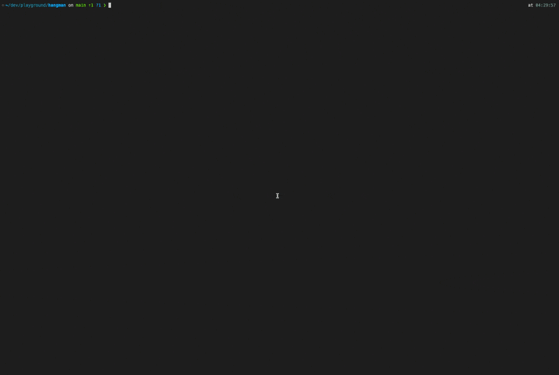

# Hangman Game

A simple command-line Hangman game written in Go.

## Demo



## Prerequisites

Install Go from [https://go.dev/doc/install](https://go.dev/doc/install)

## Installation

```bash
go mod tidy
```

or

```bash
go mod download
```

## Run

```bash
go run main.go
```

## Test

```bash
go test ./hangman/...
```

## How to Play

1. Select a category
2. Guess letters to reveal the word
3. Win by guessing all letters before running out of attempts
